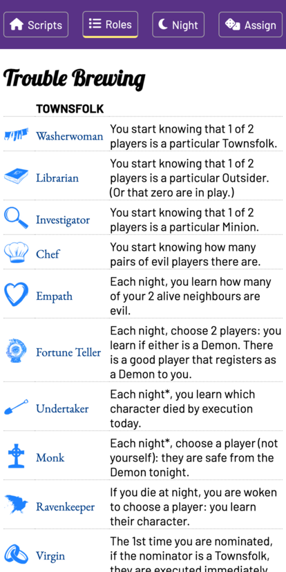
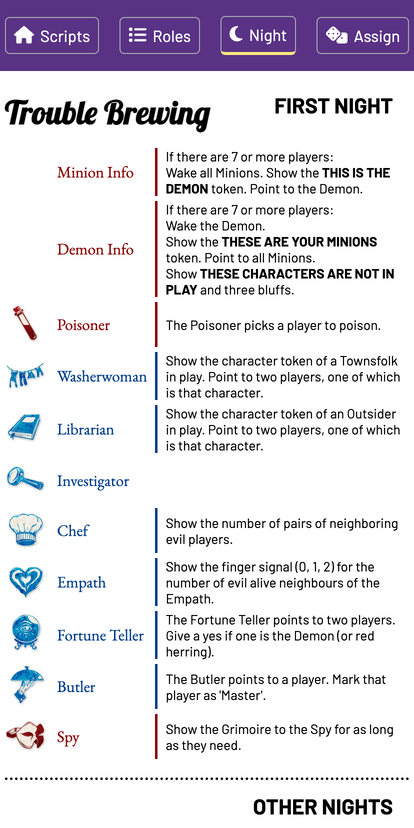
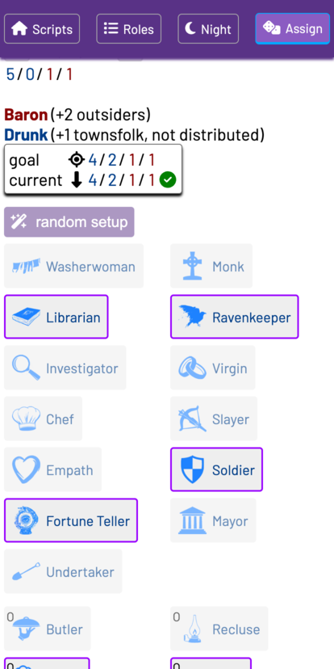
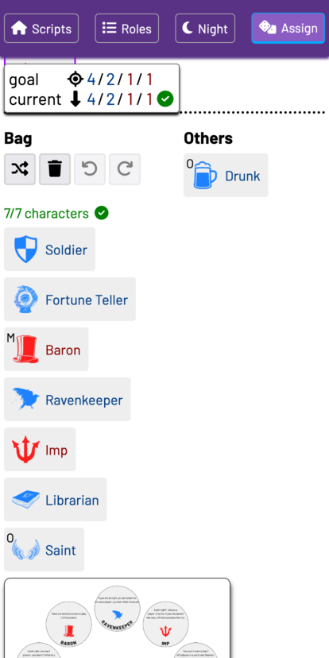

# Feature highlights

The most important feature is that the app works offline. This should work
automatically after first load in any browser. You can also "install" the
website as if it were a native mobile app: on iOS or iPadOS, open it in Safari,
click on the share icon, and select "Add to Home Screen". Opening the site from
here will look and feel like any other app - it won't have any browser UI and
will work offline.

## Roles sheet

The roles sheet works better on mobile than using the script tool's PDFs.

## Night sheet

On mobile or iPad, the night sheet is a handy reference while running a game. It
can also be printed out. This night sheet gives detailed Storyteller reminders
for each character, similar to the base 3 night sheets but unlike the script
tool.

## Assigning roles

This is most unique part of the app: a helper for selecting, randomizing, and
assigning roles for an in-person game.

The app understands roles that modify setup and tells you when the setup is
correct:

In the screenshot above, we've selected a 7 player game which has base 5/0/1/1
for townsfolk/outsiders/minions/demon. The Drunk requires selecting an
additional townsfolk and the Baron adds two outsiders (subtracting two
townsfolk). The app lets you know this means you need to select 4/2/1/1, and
that's exactly what we have selected. The other roles are grayed out since they
aren't needed to have a valid setup, but they can still be selected.

The rules for setup can really get quite complex (see
[setup.ts](./src/js/botc/setup.ts) for the core logic). For example, there can
be multiple allowed distributions, for characters like the Godfather (+1 or -1
outsider). The number of outsiders can't go above the number on the script, or
below zero, but Vigormortis -1 does cancel Godfather +1. Riot and Legion create
duplicate roles during setup. High Stakes Betting has no Minions at all and only
Riot, which is handled correctly. The Huntsman requires the Damsel, which can be
one of the usual Outsiders or might replace a townsfolk.

---

Below the list of characters the assignment tool shows what tokens are in the
"bag" (or really townsquare, since they are already ordered randomly):

Notice that the Drunk is listed because it's in play, but it won't be distributed to anybody. There are also four buttons:

- Shuffle the roles, if you want to re-randomize setup.
- Clear the current selections.
- Undo the last shuffle/clear, if you made a mistake.
- Redo.

The selections and random order are persisted so if you restart you won't lose
them. (The undo/redo history currently isn't, but that can be implemented as well.)

Finally below the characters there's a circle of tokens half-visible. These are
the tokens for the in-play roles, rendered as an image. On my iPad I drag these
out of the website and into a drawing app (Concepts), which then serves as a
Grimoire where I can track reminders and communicate with players by writing.
This is my favorite feature of the app - it really speeds up setup, and it's
much easier to run the game with all the characters and abilities clearly
visible rather than just having hand-written names.

---

Once you've set up the game, you also have to tell players their roles. Clicking
on a role in the bag list will make it full screen, and you can show that to
each player in turn:

This also really helps with setup.
